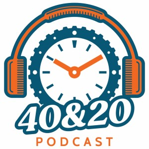

## Welcome!

## What is 40 & 20?

The [The 40 and 20 podcast](https://watchclicker.com/4020-the-watch-clicker-podcast/):

	The 40&20 Podcast is a weekly podcast hosted by our partners Andrew and Everett. 
	The show is aimed at watch enthusiasts and focuses on affordable watches and the brands 
	that make them, the people and personalities in the community, as well as other topics 
	including food, drinks, life, and other things we like. 

## What is this site?

_This_ site, 'The Compleat 40 and 20', is an unaffiliated side project, aiming to provide

- Machine-generated transcripts
- Search function
- (Coming soonish) show notes

The title is a nod to the [Compleat Angler](https://en.wikipedia.org/wiki/The_Compleat_Angler), a book by Izaak Walton, first published in 1653. (Chris Sohl suggests that it could also be a nod to [The Compleat Goggler](https://www.britannica.com/topic/The-Compleat-Goggler), 
a 1938 book by Guy Gilpatric who was an inspiration to Jacques Cousteau. I like that idea too.)

## Dive in and read

Click on [Episodes](episodes.md) to get started. Search is at the top of the page.

## How it works

[Full source code is on github](https://github.com/phubbard/tgn-whisperer) - unix tools, some python and a Makefile. 
I did a full writeup [here on my blog](https://ultracrepidarian.phfactor.net/2024/07/20/llms-can-solve-hard-problem/) if you'd like to know
how it all works.

## Contact me

If you have any issues with this site, please [open an issue on github](https://github.com/phubbard/tgn-whisperer/issues) and
I'll take a look. You can [email me](mailto:tgn@phfactor.net) for anything else. 
